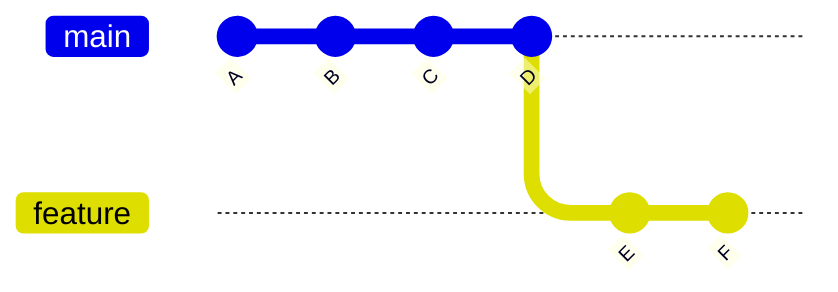
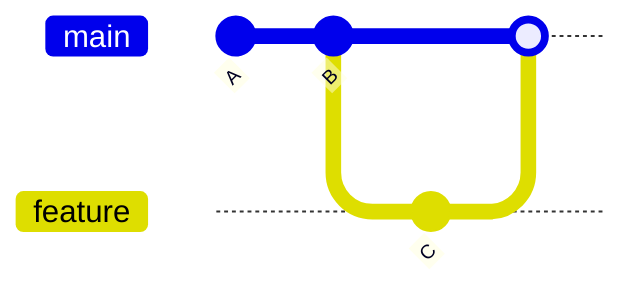
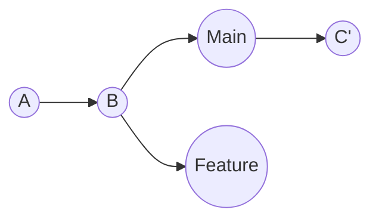

// Creating branches, switching, merging (simple), fast-forward vs non-fast-forward.

# Git Branches Basics

>[!NOTE]
> Before moving to branches you must have basic understanding of Git(commits history, commits, repo)

## What is a Branch?
As you know, a branch in Git is a separate line of development. It allows you to work on different versions of your project simultaneously without affecting the main codebase.

The default branch is usually called `main` or `master`.

There are two types of branches:
1. **Local Branches**: Exist only on your local machine.
2. **Remote Branches**: Exist on a remote repository (like GitHub, GitLab, etc.) and can be tracked locally.

> [!IMPORTANT]
> Before we continue keep in mind the branches exist in both remote and local and they may or may not differ.
> 
> Hence, keep in mind when you create/switch branches, you are doing it in *local by default*.

## Branch Divergence

After creating branches, they may **diverge** (differ) from each other as you make commits on them.

**Example:**

Both branches moved forward from commit B, but in different directions. This is called **divergence**.

It may also called, moving forward which means new commits after you branched off.

## Combining Branches: Merge vs Rebase

If changes from one branch are needed in another, you need to combine those branches.

There are 2 ways to combine branches in Git: **merging** and **rebasing**.

## Merge vs Rebase

| Aspect | Merge | Rebase |
|--------|-------|--------|
| **What it does** | Creates a new commit that combines two branches | Moves your commits to sit on top of another branch |
| **History** | Preserves the complete history of both branches | Rewrites history by creating new commits |
| **Visual representation** | History looks like a graph with branches | History looks like a straight line |
| **Commit creation** | Creates a merge commit (M) | Creates new commits with same changes (D', E') |
| **When branches diverged** | Shows exactly when and how branches diverged | Makes it look like you started work from the latest commit |
|**Use**|In Collaboration for history|Alone for simplicity|

In the diagrams, `feature` branch is  merged/rebased onto `main`.

**Merge:**

**Rebase:**

**Key Difference**: Merge keeps original history, rebase rewrites it for a cleaner timeline.
