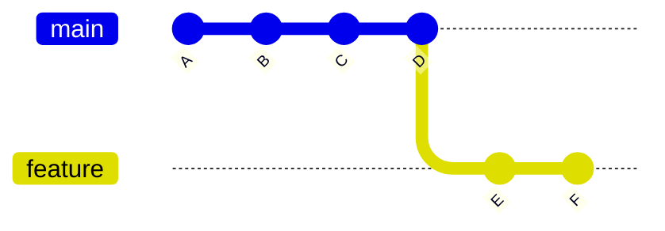
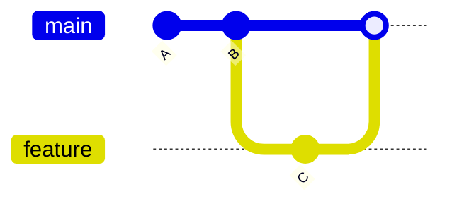
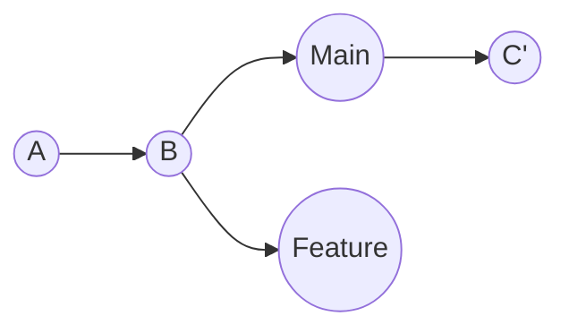

// Creating branches, switching, merging (simple), fast-forward vs non-fast-forward.

# Git Branches Basics

>[!NOTE]
> Before moving to branches you must have basic understanding of Git(commits history, commits, repo)

## What is a Branch?
As you know, a branch in Git is a separate line of development. It allows you to work on different versions of your project simultaneously without affecting the main codebase.

The default branch is usually called `main` or `master`.

There are two types of branches:
1. **Local Branches**: Exist only on your local machine.
2. **Remote Branches**: Exist on a remote repository (like GitHub, GitLab, etc.) and can be tracked locally.

> [!IMPORTANT]
> Before we continue keep in mind the branches exist in both remote and local and they may or may not differ.
> 
> Hence, keep in mind when you create/switch branches, you are doing it in *local by default*.


## Terms to Know

Before moving on, here are some key terms related to branches:

- HEAD
- detached HEAD
- branch pointer
- origin
- origin/main
- upstream (common)
- downstream (less common)
- tracking branch
- remote-tracking branch

## Branch Divergence

After creating branches, they may **diverge** (differ) from each other as you make commits on them.

**Example:**


Both branches moved forward from commit B, but in different directions. This is called **divergence**.

It may also called, moving forward which means new commits after you branched off.

## Combining Branches: Merge vs Rebase

If changes from one branch are needed in another, you need to combine those branches.

There are 2 ways to combine branches in Git: **merging** and **rebasing**.

## Merge vs Rebase

| Aspect | Merge | Rebase |
|--------|-------|--------|
| **What it does** | Creates a new commit that combines two branches | Moves your commits to sit on top of another branch |
| **History** | Preserves the complete history of both branches | Rewrites history by creating new commits |
| **Visual representation** | History looks like a graph with branches | History looks like a straight line |
| **Commit creation** | Creates a merge commit (M) | Creates new commits with same changes (D', E') |
| **When branches diverged** | Shows exactly when and how branches diverged | Makes it look like you started work from the latest commit |
|**Use**|In Collaboration for history|Alone for simplicity|


In the diagrams, `feature` branch is  merged/rebased onto `main`.

**Merge:**



**Rebase:**



**Key Difference**: Merge keeps original history, rebase rewrites it for a cleaner timeline.


### Merge

#### Merging Branches

Merging allows you to combine changes from one branch into another. Typically, you merge a `feature` branch into the `main` branch.

#### Basic Merge

First, switch to the branch you want to merge into (usually `main`), then merge:

```bash
git checkout main # switches to main
git merge <branch-name> # merges <branch-name> into main
```

Don't worry about commands, these are explained later as this is simply for understanding. Focus on concepts for now.

### Fast-Forward vs Non-Fast-Forward Merges

Now, within merging, there are two types: **fast-forward** and **non-fast-forward**.

These depend on whether the target branch (e.g., `main`) has moved forward since you created your feature branch.


#### Fast-Forward Merge (--ff)

Happens **automatically** when the target branch (e.g., `main`) has **NOT moved forward** since you created your feature branch.

**You don't need to specify `--ff`** - Git does it by default when possible, however you can use it explicitly via the flag(`--ff`).

**Scenario:**
```
main:    A---B
              \
feature:       C---D
```

When you merge feature into main:
```
main:    A---B---C---D  (main pointer just moves forward)
```

**No new commit is created**. Main just "catches up" to where feature is. It's like main was never separate.

```bash
git merge <branch-name>  # fast-forward by default if possible
```

#### Non-Fast-Forward Merge (--no-ff)

Happens when:
1. Main HAS moved forward since you branched, OR
2. You force it with `--no-ff` flag, done manually unlike automatic fast-forward, so have to explicitly use the flag.

**Scenario 1 (automatic non-ff):**
```
main:    A---B---C  (C is new commit on main)
              \
feature:       D---E
```

When you merge, Git creates a **merge commit**:
```
main:    A---B---C-------M  (M combines C and E)
              \         /
feature:       D---E
```

**Scenario 2 (forced non-ff):**
Even if fast-forward is possible, you can force a merge commit:
```bash
git merge --no-ff <branch-name>
```

This creates a merge commit even when unnecessary, which helps preserve the history that work was done on a separate branch.

**Simple Rule:**
- **Fast-forward**: Main hasn't changed → just move pointer forward (no merge commit)
- **Non-fast-forward**: Main HAS changed → create a merge commit to combine both


**Key point (to note):** 

- Git's default is `--ff` (fast-forward when possible)
- If main hasn't changed: Git does fast-forward automatically (no merge commit)
- If main HAS changed: Git does non-fast-forward automatically (creates merge commit)
- You only need `--no-ff` to **force** a merge commit even when fast-forward is possible

# Rebase

## What is Rebase?

Rebasing takes your commits from one branch and replays them on top of another branch. It makes your branch history linear and clean.

### Basic Rebase

```bash
git checkout feature
git rebase main  # moves feature commits on top of main
```

**What happens:**
1. Git finds the common ancestor of `feature` and `main`
2. Saves your feature commits temporarily
3. Moves your branch pointer to the tip of `main`
4. Applies your commits one by one on top

### When to Use Merge vs Rebase?

**Use Merge when:**
- Working on a public/shared branch
- You want to preserve exact history of how work happened
- Multiple people are working on the same feature branch

**Use Rebase when:**
- Cleaning up your local commits before pushing
- You want a linear, easy-to-read history
- Working on your own feature branch that hasn't been shared


#### Confusion

**Is Rebase like merge(Fast-Forward)?**

Answer: **No.** Fast-forward is a merge concept only. Rebase always rewrites commits by moving them. 
Fast forward Doesn't touch commits - just moves the branch pointer forward, no new commits created, no rewrititng, while rebase does the opposite, touches, moves, rewrites, even creates commits, as fast-forward is simply moving pointer forward while rebase is rewriting history (literally).


**Golden Rule**: Never rebase commits that have been pushed to a shared/public repository. It rewrites history and will cause problems for others.


## Terms to Know