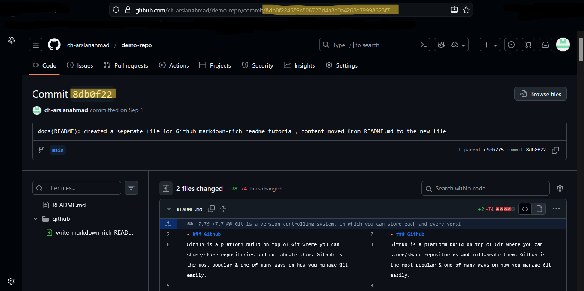

# Git Basics

As you have learnt that Git is a version control system that helps you track changes in your files and collaborate with others. Here are some fundamental concepts and commands to get you started with Git.

## Key Concepts

The following are really basic concepts in Git that you should be familiar with:
- **Repository (Repo)**: A directory (folder) that contains your project files and the history of changes made to them.
- **Commit**: A snapshot of your files at a specific point in time.
    - Each commit has a unique ID called a SHA, like 8db0f224589c808727d4a8e0a4202e79998623f7, you can even use a shortened version of it, example., 8db0f22.



- **Branch**: It can be defined as:
    - separate line of development
    - separate version of workspace of your project
    - a seperate version of your repo.

The default branch is usually called `main` or `master`.

- **Remote**: version of your repo hosted on the internet or another network.
- **Local**: version of your repo on your own computer.

Git specific Concepts that you need to know, however will understand after learning basic commands:

- **Staging Area**: A place where you can group (add) changes, before committing them.
- **Untracked Files**: Files in your working directory that are not being tracked by Git.

- `.gitignore` - tells which files, folders (or patterns) to ignore in a repo.

## Basic Git Commands

### Make a Repository

To make a repo,
```bash
git init
```

### Commit Changes

A commit is made in two steps: staging and committing.
- First you must add a file for commit (save for simplicity) 
```bash
git add <file-name>      # Stage changes for commit
git commit -m "Commit message"  # Commit staged changes with a message
```

>[!NOTE]
> For simplicity, you can think of `git add` as "adding something to save" and `git commit` as "actual save".

>[!TIP]
> You can stage all changed files at once using:
> ```bash
> git add .
> ```

#### Commit Message:

As i have told you that each commit has a SHA, but it must have a message too (except exceptions), that describes what changes were made in that commit.

A good commit message is _concise_ yet **descriptive**.

Example, when you added fingerprint authentication, a good commit message would be:

```Add fingerprint authentication
```

### Check Status

To check status if files are staged, modified, or untracked, use:

```bash
git status
```

